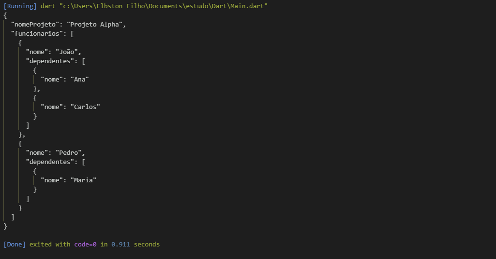

# Atividade 02
## Nesta atividade foi pedido para alterarmos um codigo dado pelo professor para que ele fizesse as seguintes funções.
1. Criar varios objetos Dependentes
2. Criar varios objetos Funcionario
3. Associar os Dependentes criados aos respectivos funcionarios 
4. Criar uma lista de Funcionarios
5. criar um objeto Equipe Projeto chamando o metodo contrutor que da nome ao projeto e insere uma coleção de funcionario 
6. Printar no formato JSON o objeto Equipe Projeto.
# Saida:

